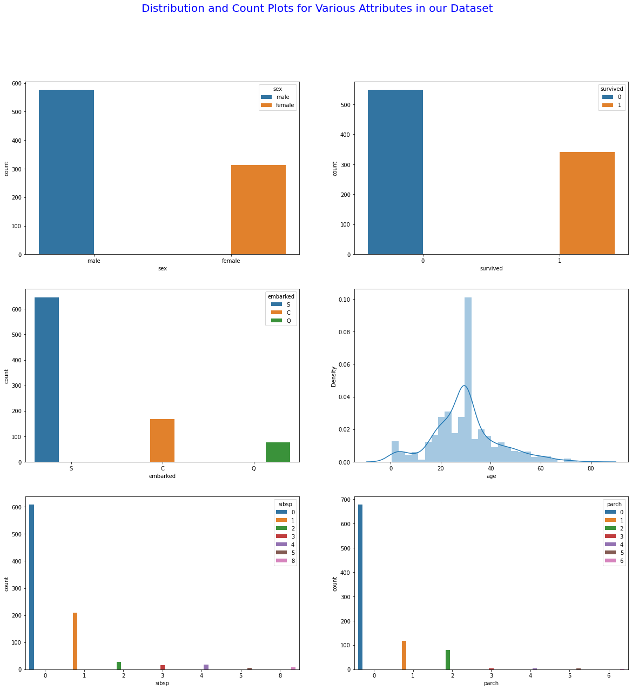
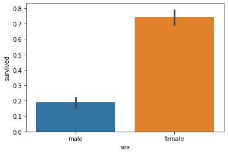
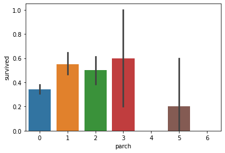
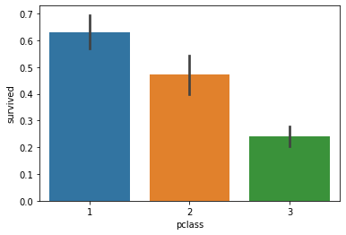
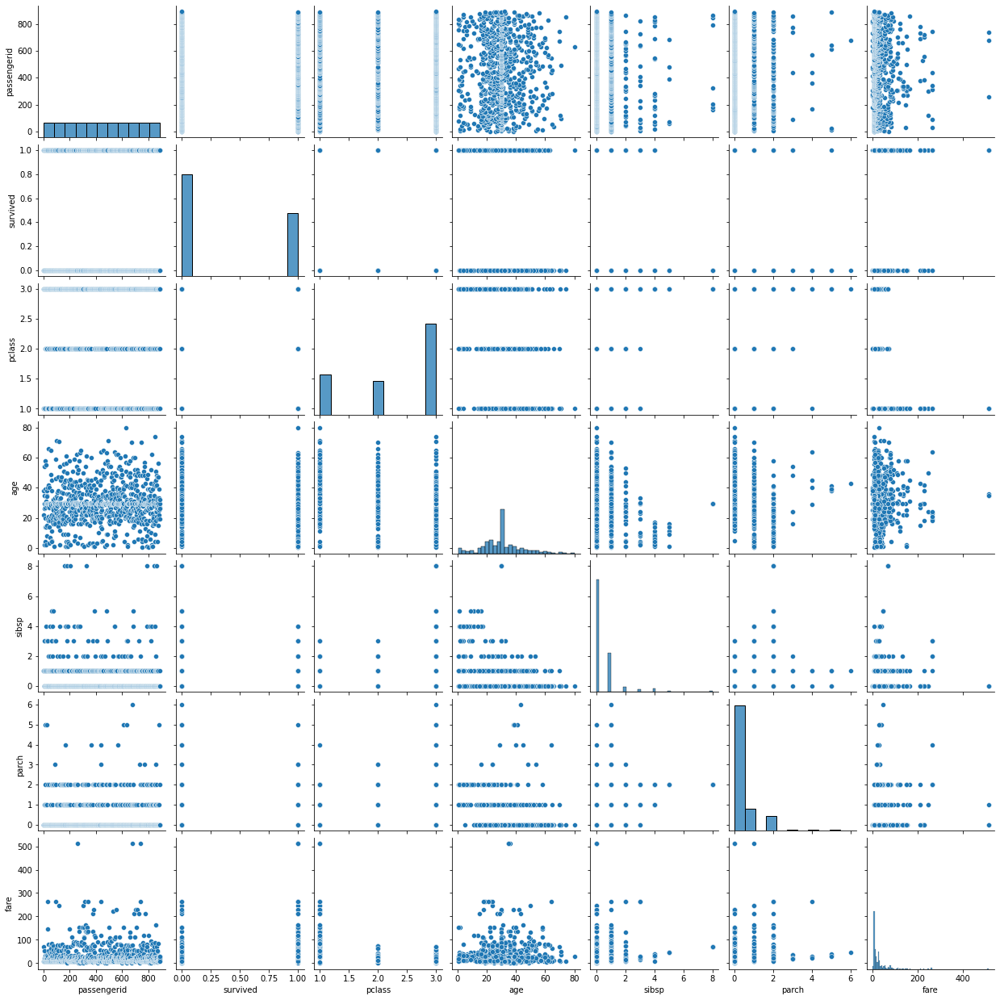
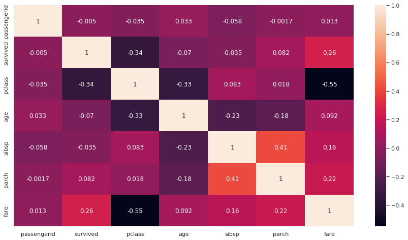

# KNN Classifier
## Titanic Passenger Survival Prediction Analysis
Titanic, in full Royal Mail Ship (RMS) Titanic, British luxury passenger liner that sank on April 14–15, 1912, during its maiden voyage, en route to New York City from Southampton, England, killing about 1,500 (see Researcher’s Note: Titanic) passengers and ship personnel. One of the most famous tragedies in modern history, it inspired numerous stories, several films, and a musical and has been the subject of much scholarship and scientific speculation.
# Specifying the Data Analytic Question
This is an analysis to predict whether or not a passenger survived in the Titanic.
# Defining the Metric of Success
The metric of success for this project is to build a model using KNN technique, which can predic whether or not the passengers who bored the titanic survived or not. The accuracy level of the prediction model should be atleast 80% to be termed as a good model.
# Recording the Experimental Data
For this project, I will perform the following actions:

1.Reading the data.

2.Checking the data.

3.Tidying the datasets Analysis. For the cleaning part, I will check for outliers, anomalies, missing values,checking for duplicates,dropping unnecessary columns and changing the column names into lowercase for uniformity and stripping off whitespaces and dashes.

4.I will the perform EDA (Univariate and Bivariate).

5 Performing Predictive Anaysis using:

  -K-nearest neighbor (kNN) classifier.
6.I will apply one optimization technique to optimize my model for better performance.

7.Challenge your solution by providing insights on how you can make improvements in model improvement.

# Exploratory Data Analysis

## Univariate

The image below shows the univariate analysis of various variables:

## Bivariate

The images below show how various sqft_living, bedrooms, and condition:

Bivariate PairPlot

Heatmap showing the correlation of all the variables:

## Conclusion and Recommendation
Random Forest Classifier performs better than the best model of KNN (80-20) split. Random Forest provides 81% accuracy, while KNN (80-20) split provides 78.77%. This, therefore make Random Forest Classifier the best option for this dataset.
