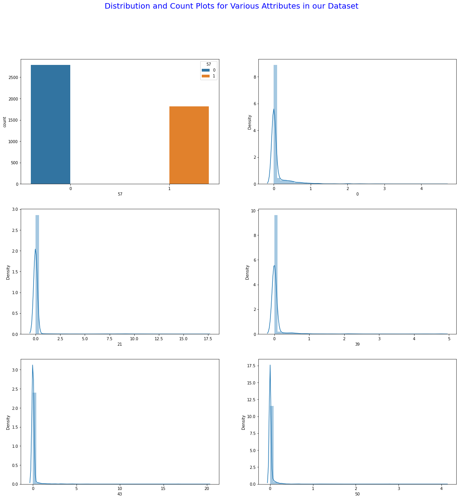

# Naive Bayes Classifier
## Spam E-mail Classification Analysis
The collection of spam e-mails came from Hewlett-Packard's postmaster and individuals who had filed spam. The collection of non-spam e-mails came from filed work and personal e-mails, and hence the word 'george' and the area code '650' are indicators of non-spam. These are useful when constructing a personalized spam filter. One would either have to blind such non-spam indicators or get a very wide collection of non-spam to generate a general purpose spam filter.
# Specifying the Data Analytic Question
This is an analysis to predict whether or not an E-mail is considered a spam or not using the Naive Bayes Classifer..
# Defining the Metric of Success
The metric of success for this project is to build a model using the Naive Bayes technique, which can predic whether or not an E-mail is a spam or not. The accuracy level of the prediction model should be atleast 80% to be termed as a good model.
# Recording the Experimental Data
For this project, I will perform the following actions:

1.Reading the data.

2.Checking the data.

3.Tidying the datasets Analysis. For the cleaning part, I will check for outliers, anomalies, missing values,checking for duplicates,dropping unnecessary columns and changing the column names into lowercase for uniformity and stripping off whitespaces and dashes.

4.I will the perform EDA (Univariate and Bivariate).

5 Performing Predictive Anaysis using:

  -Naive Bayes classifier.
6.I will apply one optimization technique to optimize my model for better performance.

7.Challenge your solution by providing insights on how you can make improvements in model improvement.

# Exploratory Data Analysis

## Univariate

The image below shows the univariate analysis of various variables:

## Bivariate
I did not conduct Bivariate Analysis because the dataset lacked column names, hence it will be difficult tp make an analysis.

## Conclusion and Recommenation
Random Forest Classifier performs better than the best model of Naive Bayes (60-40) split. Random Forest provides 90.49% accuracy, while Naive bayes (60-40) split provides 81.80%.
This, therefore, makes Random Forest Classifier the best option for this dataset.

